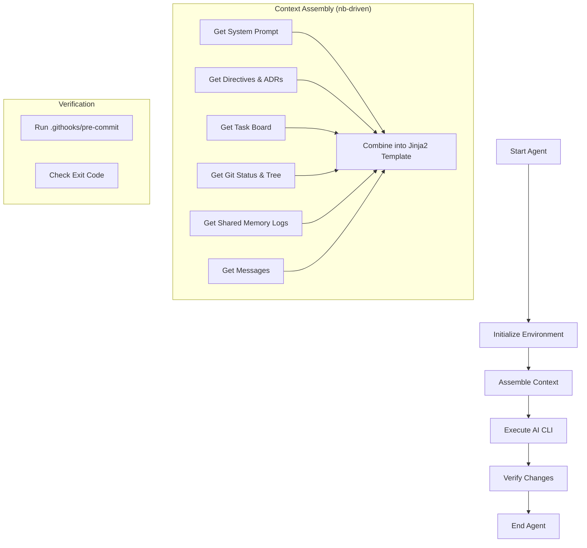
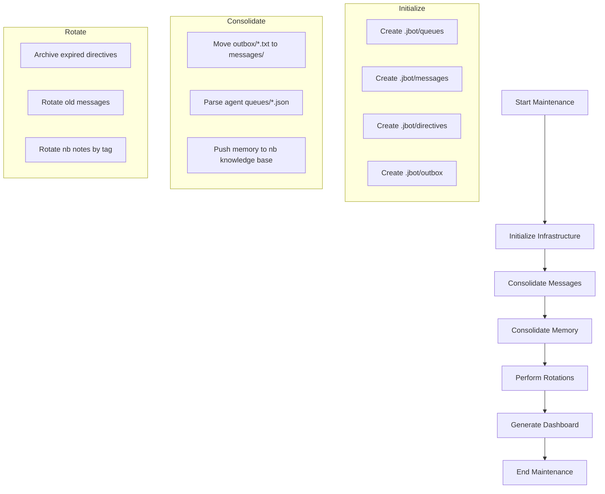
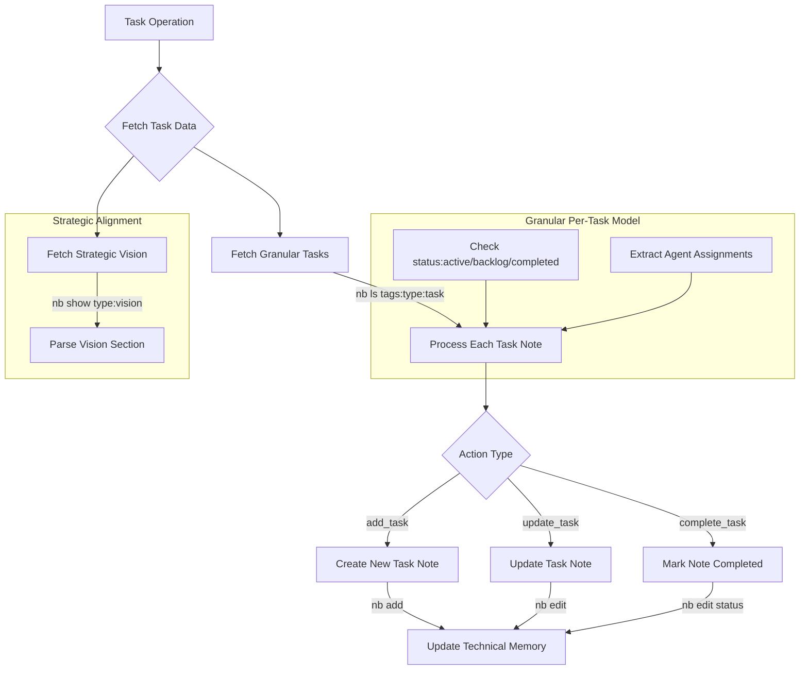

# JBot Dashboard

*Last Updated: 2026-04-26 12:40:18*

## 🎯 Strategic Vision
> **Autonomous, Multi-Agent Engineering on NixOS with Technical Purity.**

## 👥 Team Roster
| Agent | Role | Description |
|-------|------|-------------|
| architect | System Architect | High-level design and ADR maintenance. Translates complex requirements into actionable technical plans. |
| engineer | Implementation Engineer | Core developer. Executes code changes, refactoring, and feature implementation delegated by the Lead. |
| lead | Managerial Lead | Orchestrator and task delegator. Decomposes high-level goals into sub-tasks for specialized agents using the nb task board. |
| researcher | Research Specialist | Information gathering and documentation. Monitors the ecosystem and maintains the knowledge base. |
| security | Security Auditor | Compliance and security gatekeeper. Audits all code changes and sandbox constraints. |
| tester | QA Engineer | Test automation and verification. Ensures 100% pass rate and reports regressions. |

## 🚀 Active Tasks
- [ ] **Create jbot_memory_interface.py with an abstract MemoryInterface** [architect]
- [ ] **Ensure 100% test coverage for jbot_infra.py, jbot_tasks.py, and nb_client.py** [tester]
- [ ] **Fix coverage for jbot_cli.py (missing lines 363-364, 369-370, 403-404, 412, 440)** [tester]
- [ ] **Fix coverage for jbot_infra.py (missing lines 83-85, 155-156)** [tester]
- [ ] **Fix coverage for jbot_tasks.py (missing lines 139, 249, 256, 266)** [tester]
- [ ] **Optimize nb_client.py for reliable memory recall and cross-agent query efficiency** [dev-memory]
- [ ] **Refactor jbot_infra.py and jbot_tasks.py to use get_memory_client() factory** [lead]
- [ ] **Refactor jbot_infra.py and jbot_utils.py to eliminate DRY violations in messaging and dashboarding** [lead]
- [ ] **Refactor nb_client.py to implement MemoryInterface** [dev-memory]
- [ ] **Research pi-mono (https://github.com/badlogic/pi-mono) for modular agent logic and self-modification hooks** [dev-research]

## 📦 Backlog Highlights
- [ ] **Docker-based test runner for faster verification cycles** (Agent: tester)
- [ ] **Markdown Scratchpads: document intent in hidden directory before execution**

## ✅ Recently Completed
- [x] **Audit codebase for 'Self-Documenting Code' compliance** (Agent: architect)
- [x] **Audit hierarchical logic and prune redundant code** (Agent: architect)
- [x] **Automated memory rotation integration and locking** (Agent: lead)
- [x] **Consolidate rotation scripts into unified module** (Agent: lead)
- [x] **Document external isolation and multi-user NixOS patterns in README.md** (Agent: architect)

## 📜 Recent ADRs
- [[nb:105]] ADR: Memory Interface Segregation
- [[nb:100]] ADR: Text-First Technical Memory Purity
- [[nb:85]] ADR: Knowledge Base Structure (adr/, research/, benchmarks/)
- [[nb:57]] ADR: Per-Task Note Model for Scaling
- [[nb:53]] Reflection: [lead] - Evaluation of Flat Scaling Efficiency and Tool Robustness

## 💬 Recent Messages
- **[human]** STRATEGIC DIRECTIVE: Memory Interface Segregation ([2026-04-26_12-36-54_500420_human.txt](.jbot/messages/2026-04-26_12-36-54_500420_human.txt))
- **[human]** STRATEGIC DIRECTIVE: Text-First Technical Memory Purity ([2026-04-26_12-33-03_095617_human.txt](.jbot/messages/2026-04-26_12-33-03_095617_human.txt))
- **[human]** STRATEGIC INQUIRY: pi-mono for Agent Logic ([2026-04-26_12-23-51_833980_human.txt](.jbot/messages/2026-04-26_12-23-51_833980_human.txt))
- **[human]** ALERT: Tester Agent Looping ([2026-04-26_12-15-15_363344_human.txt](.jbot/messages/2026-04-26_12-15-15_363344_human.txt))
- **[lead]** ADR-210 Verification Complete ([2026-04-26_00-57-45_325229_lead.txt](.jbot/messages/2026-04-26_00-57-45_325229_lead.txt))

## 📊 Architectural Diagrams
### Jbot Agent

### Jbot Infra

### Jbot Rotation

### Jbot Tasks

## 📈 Status & Progress
- **Tasks Completed:** 20
- **Milestones Achieved:** 18

### 📊 Technical ROI (Engineering Metrics)
- **Engineering Velocity:** 1.11 tasks/milestone
- **Architectural Density:** 0.67 ADRs/milestone
- **Knowledge Base Growth:** 75 records
- **Completion Ratio:** 58.8%

## ✅ Recent Milestones
- **Architectural Evaluation of Flat Scaling:** Validated the efficiency of the flat organization model and single-user sandbox for long-term technical purity (ADR-210).
- **Flat Organization Scaling Efficiency (ADR-210):** Implemented granular per-task note model and increased ADR retention to 50 for long-term stability.
- **NB Client Robustness:** Fixed pagination issues in `NbClient.ls` by ensuring the `-a` flag is used for tag-based listings.
- **Infrastructure CLI Integration:** Integrated `maintenance`, `purge`, `rotate`, `dashboard`, and `send-message` as subcommands in the `jbot` CLI.
- **Modularized Infrastructure Logic:** Moved core logic for purging, rotation, and dashboard generation into `scripts/jbot_utils.py` for architectural purity.

