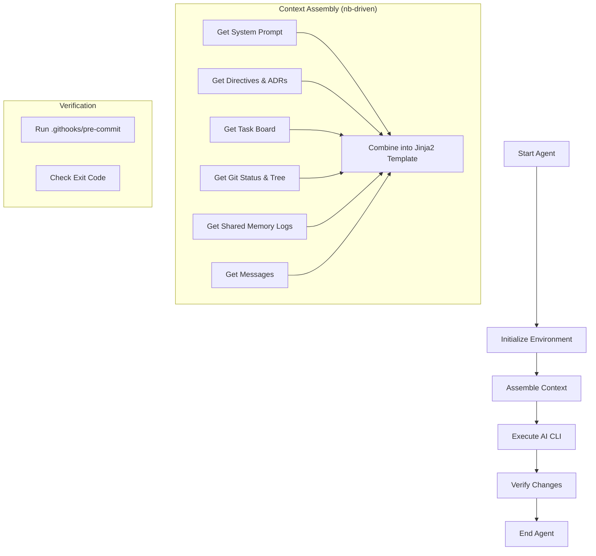
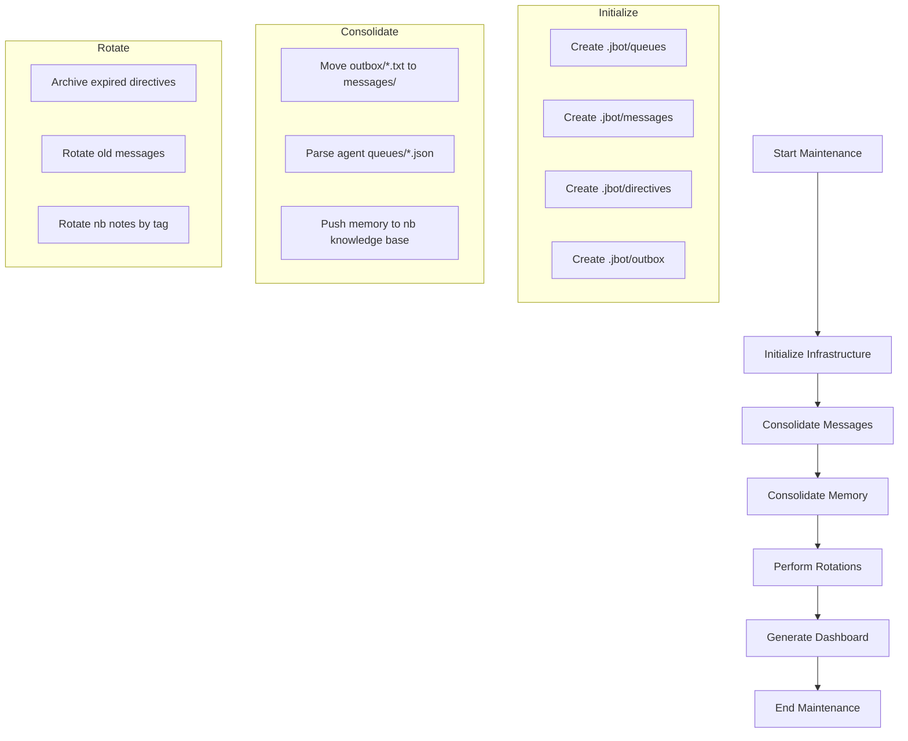
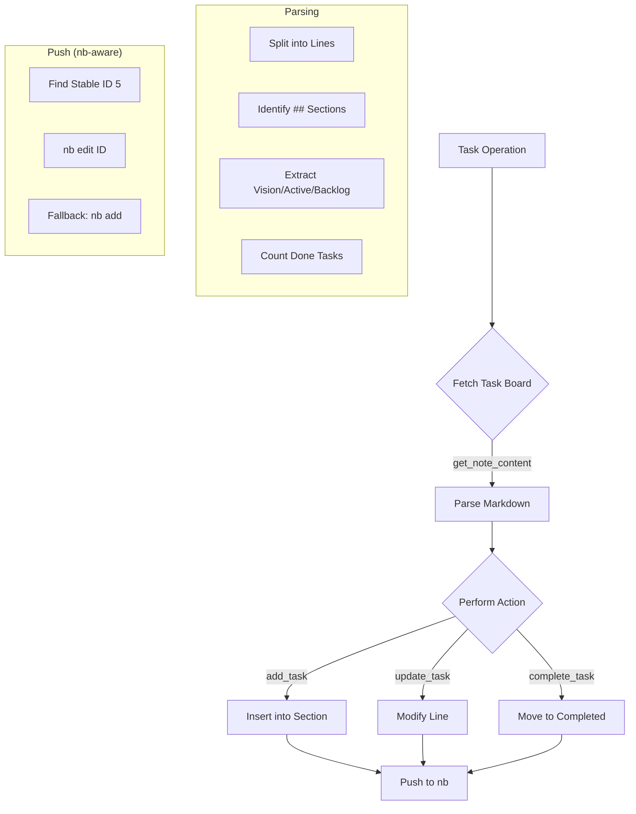

# JBot Dashboard

*Last Updated: 2026-04-26 00:54:54*

## 🎯 Strategic Vision
> **Autonomous, Multi-Agent Engineering on NixOS with Technical Purity.**

## 👥 Team Roster
| Agent | Role | Description |
|-------|------|-------------|
| architect | Principal Architect | Review feature specialization logic, ensure modularity, and challenge over-engineering. |
| ceo | Technical Founder (CEO) | Set product vision, prioritize the roadmap, and ensure all specialized agents align with long-term goals. |
| dev-alignment | Alignment Specialist | Ensure technical implementations perfectly map to strategic goals and formal directives in nb. |
| dev-cleanup | Maintenance Engineer (Janitor) | Proactively prune unused Nix code, stale memory notes, and technical debt using purity tools. |
| dev-docs | Technical Writer | Maintain high-density documentation, Mermaid diagrams, and ADR clarity across the repo. |
| dev-memory | Memory Specialist | Expert in RAG, knowledge base (nb) integration, and memory consolidation logic. |
| dev-research | Research Specialist | Investigate new AI models, NixOS patterns, and emerging technologies to keep the organization at the cutting edge. |
| dev-scheduler | Scheduling Specialist | Expert in systemd integration, agent orchestration, and NixOS module design. |
| lead | Lead Developer | Main coordinator and implementer for core JBot infrastructure. |
| manager | Conflict & Alignment Manager | Monitor agent outputs for strategic drift or non-compliance. Intervene when specialized agents fail to align with the organization's goals. |
| tester | QA Engineer | Verify specialized feature implementations, run tests, and report regressions. |

## 🚀 Active Tasks
No active tasks.

## 📦 Backlog Highlights
- [ ] **Implement automated PR generation for infrastructure updates**

## ✅ Recently Completed
- [x] **Verify ADR-210 implementation and update dashboard** (Agent: lead)

## 📜 Recent ADRs
- [[nb:63]] ADR-210: Flat Organization Scaling Efficiency
- [[nb:57]] ADR: Per-Task Note Model for Scaling
- [[nb:53]] Reflection: [lead] - Evaluation of Flat Scaling Efficiency and Tool Robustness
- [[nb:51]] Knowledge Base Guide (nb)
- [[nb:49]] Reflection: [architect] - Architectural Evaluation of Flat Scaling Efficiency

## 📊 Architectural Diagrams
### Jbot Agent

### Jbot Infra

### Jbot Tasks

## 📈 Status & Progress
- **Tasks Completed:** 1
- **Milestones Achieved:** 15

### 📊 Technical ROI (Engineering Metrics)
- **Engineering Velocity:** 0.07 tasks/milestone
- **Architectural Density:** 0.73 ADRs/milestone
- **Knowledge Base Growth:** 31 records
- **Completion Ratio:** 50.0%

## ✅ Recent Milestones
- **Infrastructure CLI Integration:** Integrated `maintenance`, `purge`, `rotate`, `dashboard`, and `send-message` as subcommands in the `jbot` CLI.
- **Modularized Infrastructure Logic:** Moved core logic for purging, rotation, and dashboard generation into `scripts/jbot_utils.py` for architectural purity.
- **Consolidated Rotation Logic:** Unified memory, task, and message rotation under a single `jbot rotate` command.
- **Centralized Maintenance:** Implemented `jbot maintenance` to orchestrate all infrastructure tasks.
- **Centralized JBot CLI:** Developed and integrated a unified `jbot` CLI tool for monitoring the organization.

