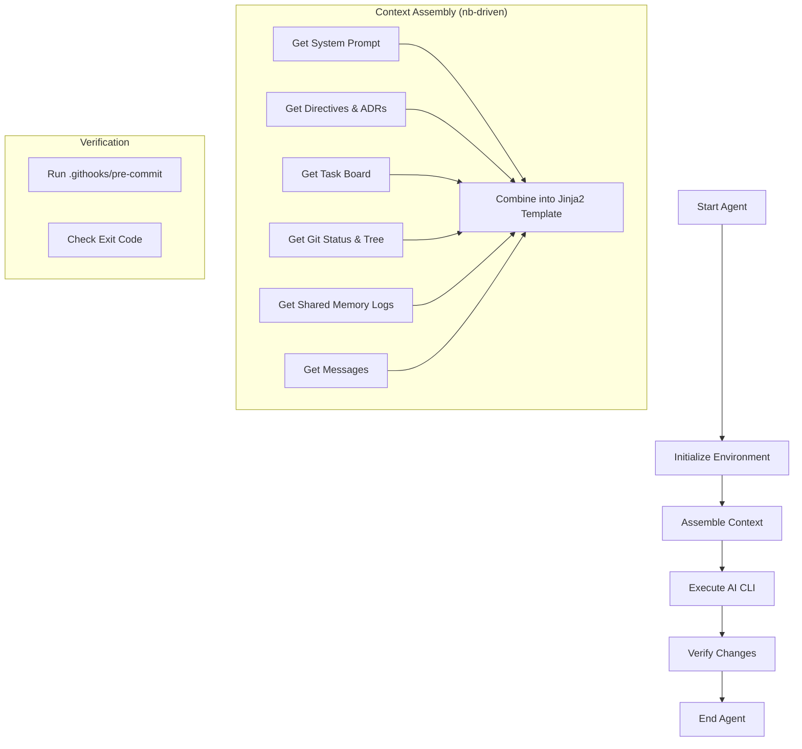
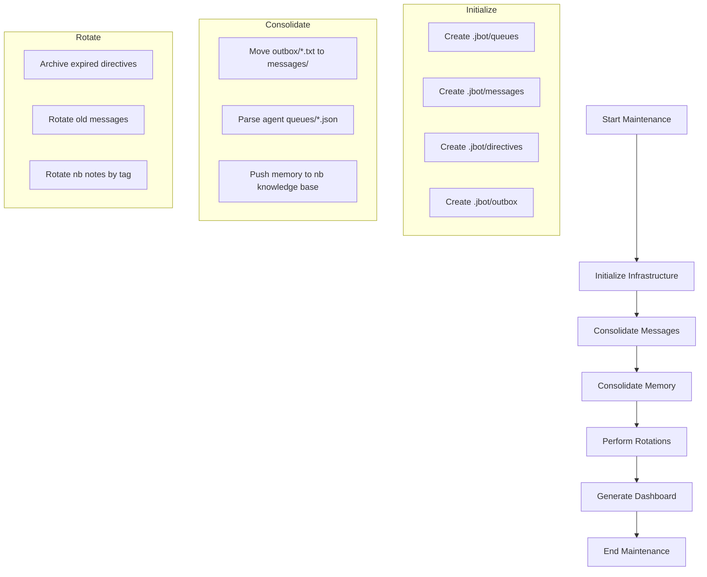
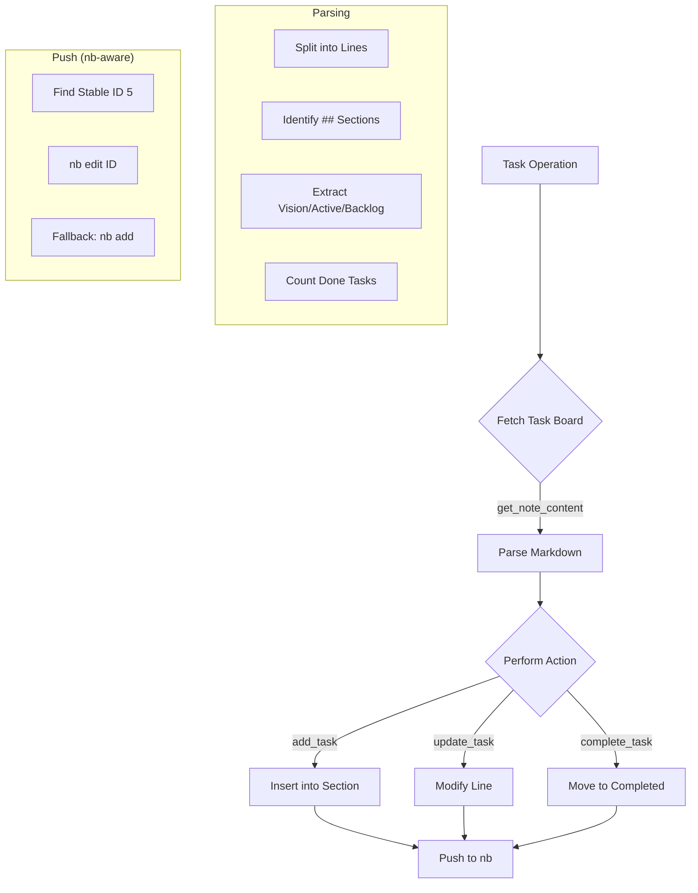

# JBot Dashboard

*Last Updated: 2026-04-25 19:04:41*

## 🎯 Strategic Vision
> **Autonomous, Multi-Agent Engineering on NixOS with Technical Purity.**

## 👥 Team Roster
| Agent | Role | Description |
|-------|------|-------------|
| architect | Principal Architect | Critique architectural decisions, advocate for simplicity, challenge over-engineering, and keep the codebase lean. |
| ceo | Technical Founder (CEO) | Set product vision, prioritize the roadmap in TASKS.md, and ensure architectural decisions align with long-term goals. |
| lead | Lead Developer | Main autonomous agent managing the JBot project infrastructure and implementation. |
| tester | QA Engineer | Verify architectural changes, run tests, and report regressions to the team. |

## 🚀 Active Tasks
No active tasks.

## 📦 Backlog Highlights
- [ ] Implement automated PR generation for infrastructure updates.

## ✅ Recently Completed
- [x] **Evaluate scaling efficiency in flat organization** (Agent: lead)
- Add ROI metrics visualization to dashboard.
- [x] **Extract jbot-launcher.sh for better testability and auditability.**
- [x] **Implement ShellCheck static analysis for githooks and launcher.**
- [x] Research formal verification for core bash scripts. (Architect)

## 📜 Recent ADRs
- [[nb:208]] Reflection: [lead] - Evaluation of Flat Scaling Efficiency and Tool Robustness
- [[nb:207]] Reflection: [architect] - Architectural Evaluation of Flat Scaling Efficiency
- [[nb:205]] ADR: Technical ROI and Engineering Metrics
- [[nb:202]] ADR: Formal Verification for Bash Infrastructure
- [[nb:198]] Authoritative Task Board (CEO)

## 📊 Architectural Diagrams
### Jbot Agent

### Jbot Infra

### Jbot Tasks

## 📈 Status & Progress
- **Tasks Completed:** 15
- **Milestones Achieved:** 15

### 📊 Technical ROI (Engineering Metrics)
- **Engineering Velocity:** 1.00 tasks/milestone
- **Architectural Density:** 1.27 ADRs/milestone
- **Knowledge Base Growth:** 52 records
- **Completion Ratio:** 93.8%

## ✅ Recent Milestones
- **Infrastructure CLI Integration:** Integrated `maintenance`, `purge`, `rotate`, `dashboard`, and `send-message` as subcommands in the `jbot` CLI.
- **Modularized Infrastructure Logic:** Moved core logic for purging, rotation, and dashboard generation into `scripts/jbot_utils.py` for architectural purity.
- **Consolidated Rotation Logic:** Unified memory, task, and message rotation under a single `jbot rotate` command.
- **Centralized Maintenance:** Implemented `jbot maintenance` to orchestrate all infrastructure tasks.
- **Centralized JBot CLI:** Developed and integrated a unified `jbot` CLI tool for monitoring the organization.

