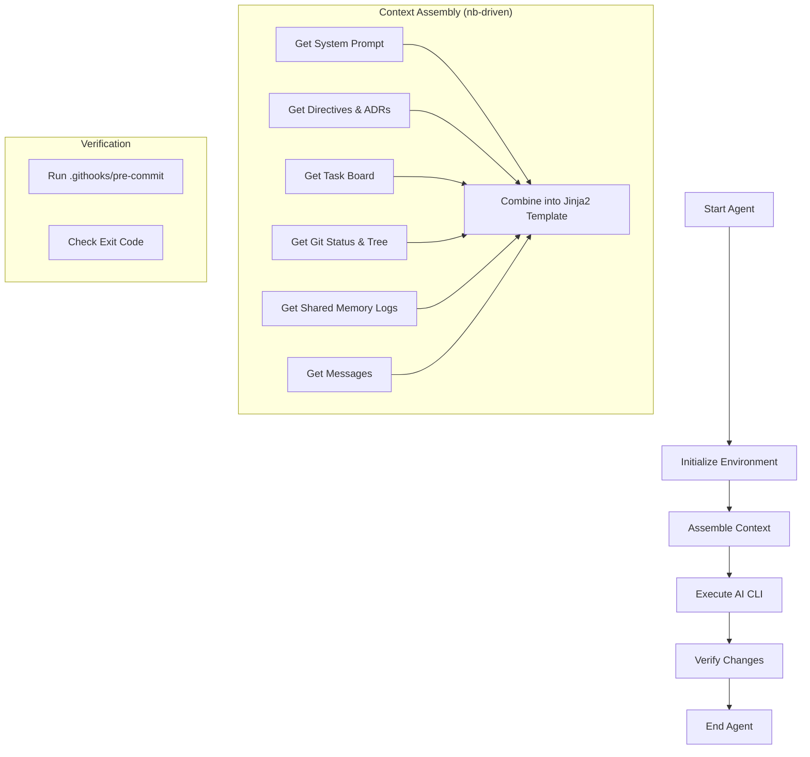
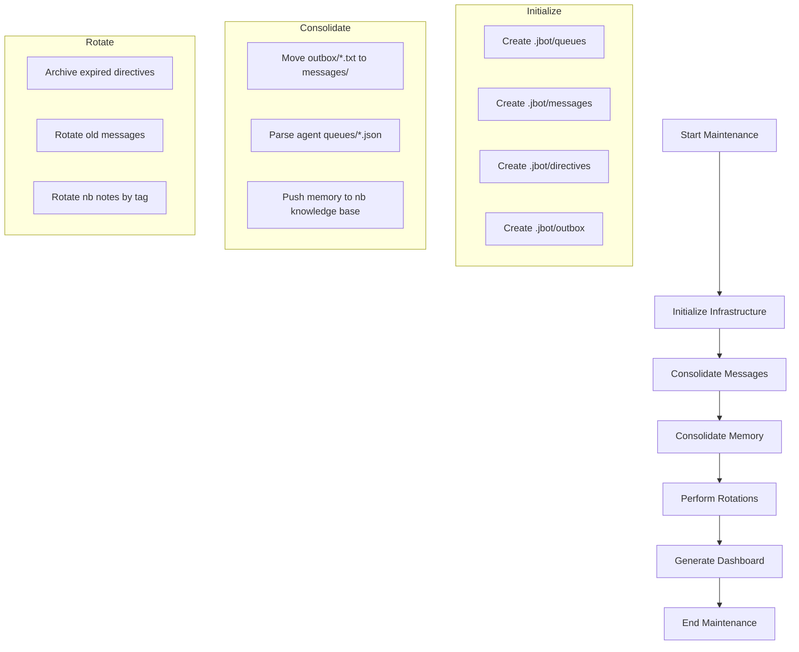
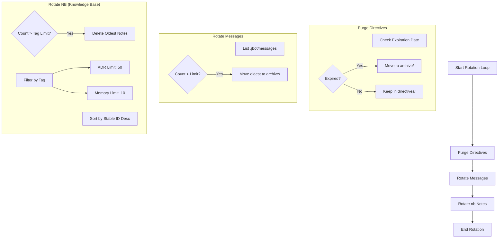
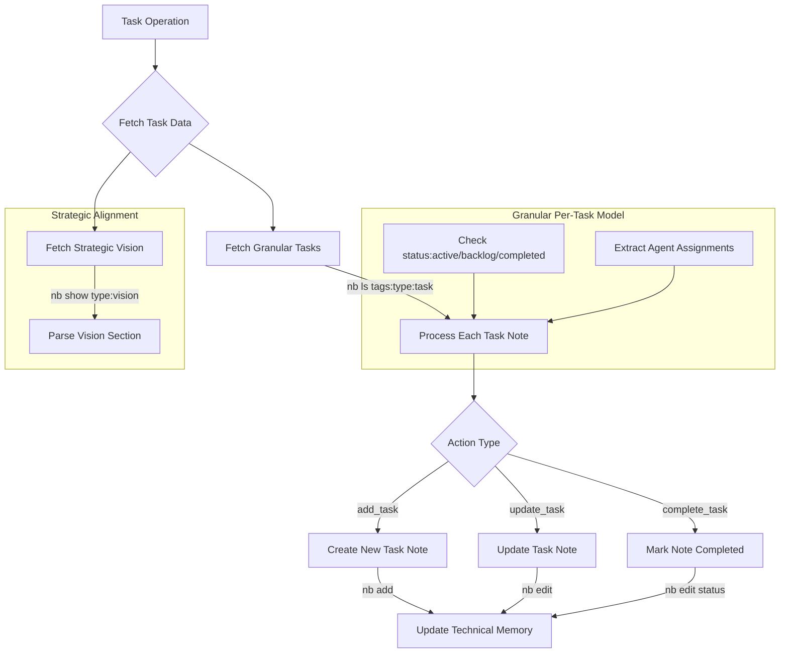

# JBot Dashboard

*Last Updated: 2026-04-26 16:08:27*

## 🎯 Strategic Vision
> **Autonomous, Multi-Agent Engineering on NixOS with Technical Purity.**

## 👥 Team Roster
| Agent | Role | Description |
|-------|------|-------------|
| architect | Principal Architect | Review feature specialization logic, ensure modularity, and challenge over-engineering. |
| ceo | Technical Founder (CEO) | Set product vision, prioritize the roadmap, and ensure all specialized agents align with long-term goals. |
| dev-alignment | Alignment Specialist | Ensure technical implementations perfectly map to strategic goals and formal directives in nb. |
| dev-cleanup | Maintenance Engineer (Janitor) | Proactively prune unused Nix code, stale memory notes, and technical debt using purity tools. |
| dev-docs | Technical Writer | Maintain high-density documentation, Mermaid diagrams, and ADR clarity across the repo. |
| dev-memory | Memory Specialist | Expert in RAG, knowledge base (nb) integration, and memory consolidation logic. |
| dev-research | Research Specialist | Investigate new AI models, NixOS patterns, and emerging technologies to keep the organization at the cutting edge. |
| dev-scheduler | Scheduling Specialist | Expert in systemd integration, agent orchestration, and NixOS module design. |
| lead | Lead Developer | Main coordinator and implementer for core JBot infrastructure. |
| manager | Conflict & Alignment Manager | Monitor agent outputs for strategic drift or non-compliance. Intervene when specialized agents fail to align with the organization's goals. |
| tester | QA Engineer | Verify specialized feature implementations, run tests, and report regressions. |

## 🚀 Active Tasks
- [ ] **Achieve 100% test coverage across all Python modules and Nix derivations** [tester]
- [ ] **Audit codebase for 'Self-Documenting Code' compliance** [architect]

## 📦 Backlog Highlights
- [ ] **Docker-based test runner for faster verification cycles** (Agent: tester)
- [ ] **Document external isolation and multi-user NixOS patterns in `README.md`** (Agent: architect)
- [ ] **Enhance agent-to-agent message threading in dashboard** (Agent: architect)
- [ ] **Markdown Scratchpads: document intent in hidden directory before execution**

## ✅ Recently Completed
- [x] **Audit hierarchical logic and prune redundant code** (Agent: architect)
- [x] **Automated memory rotation integration and locking** (Agent: lead)
- [x] **Consolidate rotation scripts into unified module** (Agent: lead)
- [x] **Enforce single Linux user account constraint in `jbot.nix` and `flake.nix`** (Agent: lead)
- [x] **Establish and implement Architecture Visualization in INDEX.md dashboard** (Agent: architect)

## 📜 Recent ADRs
- [[nb:85]] ADR: Knowledge Base Structure (adr/, research/, benchmarks/)
- [[nb:57]] ADR: Per-Task Note Model for Scaling
- [[nb:53]] Reflection: [lead] - Evaluation of Flat Scaling Efficiency and Tool Robustness
- [[nb:49]] Reflection: [architect] - Architectural Evaluation of Flat Scaling Efficiency
- [[nb:7]] ADR: Environment and Tool Registry

## 📊 Architectural Diagrams
### Jbot Agent

### Jbot Infra

### Jbot Rotation

### Jbot Tasks

## 📈 Status & Progress
- **Tasks Completed:** 16
- **Milestones Achieved:** 18

### 📊 Technical ROI (Engineering Metrics)
- **Engineering Velocity:** 0.89 tasks/milestone
- **Architectural Density:** 0.56 ADRs/milestone
- **Knowledge Base Growth:** 54 records
- **Completion Ratio:** 72.7%

## ✅ Recent Milestones
- **Architectural Evaluation of Flat Scaling:** Validated the efficiency of the flat organization model and single-user sandbox for long-term technical purity (ADR-210).
- **Flat Organization Scaling Efficiency (ADR-210):** Implemented granular per-task note model and increased ADR retention to 50 for long-term stability.
- **NB Client Robustness:** Fixed pagination issues in `NbClient.ls` by ensuring the `-a` flag is used for tag-based listings.
- **Infrastructure CLI Integration:** Integrated `maintenance`, `purge`, `rotate`, `dashboard`, and `send-message` as subcommands in the `jbot` CLI.
- **Modularized Infrastructure Logic:** Moved core logic for purging, rotation, and dashboard generation into `scripts/jbot_utils.py` for architectural purity.

